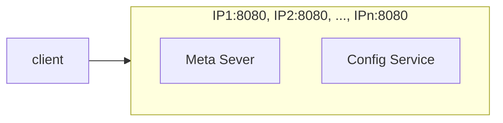
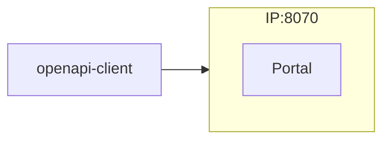
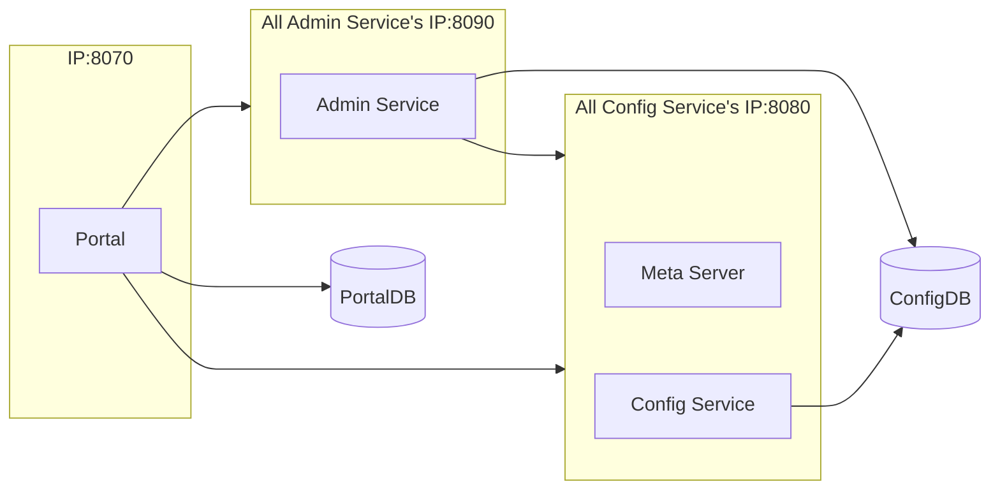

本文档介绍了如何按照分布式部署的方式编译、打包、部署Apollo配置中心，从而可以在开发、测试、生产等环境分别部署运行。

> 如果只是需要在本地快速部署试用Apollo的话，可以参考[Quick Start](zh/deployment/quick-start)

# &nbsp;
# 一、准备工作

## 1.1 运行时环境

### 1.1.1 OS

服务端基于Spring Boot，启动脚本理论上支持所有Linux发行版，建议[CentOS 7](https://www.centos.org/)。

### 1.1.2 Java

* Apollo服务端：1.8+
* Apollo客户端：1.8+
    * 如需运行在 Java 1.7 运行时环境，请使用 1.x 版本的 apollo 客户端，如 1.9.1

在配置好后，可以通过如下命令检查：
```sh
java -version
```

样例输出：
```sh
java version "1.8.0_74"
Java(TM) SE Runtime Environment (build 1.8.0_74-b02)
Java HotSpot(TM) 64-Bit Server VM (build 25.74-b02, mixed mode)
```

## 1.2 MySQL

* 版本要求：5.6.5+

Apollo的表结构对`timestamp`使用了多个default声明，所以需要5.6.5以上版本。

连接上MySQL后，可以通过如下命令检查：
```sql
SHOW VARIABLES WHERE Variable_name = 'version';
```

| Variable_name | Value  |
|---------------|--------|
| version       | 5.7.11 |

> 注1：MySQL版本可以降级到5.5，详见[mysql 依赖降级讨论](https://github.com/apolloconfig/apollo/issues/481)。

> 注2：如果希望使用Oracle的话，可以参考[vanpersl](https://github.com/vanpersl)在Apollo 0.8.0基础上开发的[Oracle适配代码](https://github.com/apolloconfig/apollo/compare/v0.8.0...vanpersl:db-oracle)，Oracle版本为10.2.0.1.0。

> 注3：如果希望使用Postgres的话，可以参考[oaksharks](https://github.com/oaksharks)在Apollo 0.9.1基础上开发的[Pg适配代码](https://github.com/oaksharks/apollo/compare/ac10768ee2e11c488523ca0e845984f6f71499ac...oaksharks:pg)，Postgres的版本为9.3.20，也可以参考[xiao0yy](https://github.com/xiao0yy)在Apollo 0.10.2基础上开发的[Pg适配代码](https://github.com/apolloconfig/apollo/issues/1293)，Postgres的版本为9.5。

## 1.3 环境

分布式部署需要事先确定部署的环境以及部署方式。

Apollo目前支持以下环境：
* DEV
    * 开发环境
* FAT
    * 测试环境，相当于alpha环境(功能测试)
* UAT
    * 集成环境，相当于beta环境（回归测试）
* PRO
    * 生产环境

> 如果希望添加自定义的环境名称，具体步骤可以参考[Portal如何增加环境](zh/faq/common-issues-in-deployment-and-development-phase?id=_4-portal如何增加环境？)

可以参考 [部署架构](zh/deployment/deployment-architecture.md)


## 1.4 网络策略
分布式部署的时候，`apollo-configservice`和`apollo-adminservice`需要把自己的IP和端口注册到Meta Server（apollo-configservice本身）。

Apollo客户端和Portal会从Meta Server获取服务的地址（IP+端口），然后通过服务地址直接访问。

需要注意的是，`apollo-configservice`和`apollo-adminservice`是基于内网可信网络设计的，所以出于安全考虑，**请不要将`apollo-configservice`和`apollo-adminservice`直接暴露在公网**。

所以如果实际部署的机器有多块网卡（如docker），或者存在某些网卡的IP是Apollo客户端和Portal无法访问的（如网络安全限制），那么我们就需要在`apollo-configservice`和`apollo-adminservice`中做相关配置来解决连通性问题。

### 1.4.1 忽略某些网卡

可以分别修改`apollo-configservice`和`apollo-adminservice`的startup.sh，通过JVM System Property传入-D参数，也可以通过OS Environment Variable传入，下面的例子会把`docker0`和`veth`开头的网卡在注册到Eureka时忽略掉。

JVM System Property示例：

```properties
-Dspring.cloud.inetutils.ignoredInterfaces[0]=docker0
-Dspring.cloud.inetutils.ignoredInterfaces[1]=veth.*
```

OS Environment Variable示例：

```properties
SPRING_CLOUD_INETUTILS_IGNORED_INTERFACES[0]=docker0
SPRING_CLOUD_INETUTILS_IGNORED_INTERFACES[1]=veth.*
```

### 1.4.2 指定要注册的IP
可以分别修改`apollo-configservice`和`apollo-adminservice`的startup.sh，通过JVM System Property传入-D参数，也可以通过OS Environment Variable传入，下面的例子会指定注册的IP为`1.2.3.4`。

JVM System Property示例：

```properties
-Deureka.instance.ip-address=1.2.3.4
```

OS Environment Variable示例：

```properties
EUREKA_INSTANCE_IP_ADDRESS=1.2.3.4
```

### 1.4.3 指定要注册的URL

可以分别修改`apollo-configservice`和`apollo-adminservice`的startup.sh，通过JVM System Property传入-D参数，也可以通过OS Environment Variable传入，下面的例子会指定注册的URL为`http://1.2.3.4:8080`。

JVM System Property示例：

```properties
-Deureka.instance.homePageUrl=http://1.2.3.4:8080
-Deureka.instance.preferIpAddress=false
```

OS Environment Variable示例：

```properties
EUREKA_INSTANCE_HOME_PAGE_URL=http://1.2.3.4:8080
EUREKA_INSTANCE_PREFER_IP_ADDRESS=false
```

### 1.4.4 直接指定apollo-configservice地址

如果Apollo部署在公有云上，本地开发环境无法连接，但又需要做开发测试的话，客户端可以升级到0.11.0版本及以上，然后配置[跳过Apollo Meta Server服务发现](zh/usage/java-sdk-user-guide#_1222-跳过apollo-meta-server服务发现)

### 1.4.5 打通网络

在一些公司（例如金融行业的公司），存在很多防火墙和网络隔离，需要打通网络（让ip1可以访问ip2的某个端口）

#### 1.4.5.1 打通客户端到配置中心的网络

对于使用配置中心的客户端，

client需要访问所有（或者相同机房内的）Meta Server和Config Service（默认都是8080端口），请不要打通Client到Admin Service的网络



如果某个应用需要使用openapi，还需要访问Portal（默认是8070端口）



#### 1.4.5.2 打通配置中心内部的网络

对于配置中心自己内部，由于各个服务之间需要互相访问，所以也要保证网络上的连通



# 二、部署步骤

部署步骤总体还是比较简单的，Apollo的唯一依赖是数据库，所以需要首先把数据库准备好，然后根据实际情况，选择不同的部署方式：

> [@lingjiaju](https://github.com/lingjiaju)录制了一系列Apollo快速上手视频，如果看文档觉得略繁琐的话，不妨可以先看一下他的[视频教程](https://pan.baidu.com/s/1blv87EOZS77NWT8Amkijkw#list/path=%2F)。

> 如果部署过程中遇到了问题，可以参考[部署&开发遇到的常见问题](zh/faq/common-issues-in-deployment-and-development-phase)，一般都能找到答案。

## 2.1 创建数据库
Apollo服务端共需要两个数据库：`ApolloPortalDB`和`ApolloConfigDB`，我们把数据库、表的创建和样例数据都分别准备了sql文件，只需要导入数据库即可。

需要注意的是ApolloPortalDB只需要在生产环境部署一个即可，而ApolloConfigDB需要在每个环境部署一套，如fat、uat和pro分别部署3套ApolloConfigDB。

> 注意：如果你本地已经创建过Apollo数据库，请注意备份数据。我们准备的sql文件会清空Apollo相关的表。

### 2.1.1 创建ApolloPortalDB

可以根据实际情况选择通过手动导入SQL或是通过[Flyway](https://flywaydb.org/)自动导入SQL创建。

#### 2.1.1.1 手动导入SQL创建

通过各种MySQL客户端导入[apolloportaldb.sql](https://github.com/apolloconfig/apollo/blob/master/scripts/sql/apolloportaldb.sql)即可。

以MySQL原生客户端为例：
```sql
source /your_local_path/scripts/sql/apolloportaldb.sql
```

#### 2.1.1.2 通过Flyway导入SQL创建

> 需要1.3.0及以上版本

1. 根据实际情况修改[flyway-portaldb.properties](https://github.com/apolloconfig/apollo/blob/master/scripts/flyway/flyway-portaldb.properties)中的`flyway.user`、`flyway.password`和`flyway.url`配置
2. 在apollo项目根目录下执行`mvn -N -Pportaldb flyway:migrate`

#### 2.1.1.3 验证

导入成功后，可以通过执行以下sql语句来验证：
```sql
select `Id`, `Key`, `Value`, `Comment` from `ApolloPortalDB`.`ServerConfig` limit 1;
```

| Id | Key                | Value | Comment          |
|----|--------------------|-------|------------------|
| 1  | apollo.portal.envs | dev   | 可支持的环境列表 |

> 注：ApolloPortalDB只需要在生产环境部署一个即可

### 2.1.2 创建ApolloConfigDB

可以根据实际情况选择通过手动导入SQL或是通过[Flyway](https://flywaydb.org/)自动导入SQL创建。

#### 2.1.2.1 手动导入SQL

通过各种MySQL客户端导入[apolloconfigdb.sql](https://github.com/apolloconfig/apollo/blob/master/scripts/sql/apolloconfigdb.sql)即可。

以MySQL原生客户端为例：
```sql
source /your_local_path/scripts/sql/apolloconfigdb.sql
```

#### 2.1.2.2 通过Flyway导入SQL

> 需要1.3.0及以上版本

1. 根据实际情况修改[flyway-configdb.properties](https://github.com/apolloconfig/apollo/blob/master/scripts/flyway/flyway-configdb.properties)中的`flyway.user`、`flyway.password`和`flyway.url`配置
2. 在apollo项目根目录下执行`mvn -N -Pconfigdb flyway:migrate`

#### 2.1.2.3 验证

导入成功后，可以通过执行以下sql语句来验证：
```sql
select `Id`, `Key`, `Value`, `Comment` from `ApolloConfigDB`.`ServerConfig` limit 1;
```
| Id | Key                | Value                         | Comment       |
|----|--------------------|-------------------------------|---------------|
| 1  | eureka.service.url | http://127.0.0.1:8080/eureka/ | Eureka服务Url |

> 注：ApolloConfigDB需要在每个环境部署一套，如fat、uat和pro分别部署3套ApolloConfigDB

#### 2.1.2.4 从别的环境导入ApolloConfigDB的项目数据
如果是全新部署的Apollo配置中心，请忽略此步。

如果不是全新部署的Apollo配置中心，比如已经使用了一段时间，这时在Apollo配置中心已经创建了不少项目以及namespace等，那么在新环境中的ApolloConfigDB中需要从其它正常运行的环境中导入必要的项目数据。

主要涉及ApolloConfigDB的下面4张表，下面同时附上需要导入的数据查询语句：

1. App
    * 导入全部的App
    * 如：insert into `新环境的ApolloConfigDB`.`App` select * from `其它环境的ApolloConfigDB`.`App` where `IsDeleted` = 0;
2. AppNamespace
    * 导入全部的AppNamespace
    * 如：insert into `新环境的ApolloConfigDB`.`AppNamespace` select * from `其它环境的ApolloConfigDB`.`AppNamespace` where `IsDeleted` = 0;
3. Cluster
    * 导入默认的default集群
    * 如：insert into `新环境的ApolloConfigDB`.`Cluster` select * from `其它环境的ApolloConfigDB`.`Cluster` where `Name` = 'default' and `IsDeleted` = 0;
4. Namespace
    * 导入默认的default集群中的namespace
    * 如：insert into `新环境的ApolloConfigDB`.`Namespace` select * from `其它环境的ApolloConfigDB`.`Namespace` where `ClusterName` = 'default' and `IsDeleted` = 0;

同时也别忘了通知用户在新的环境给自己的项目设置正确的配置信息，尤其是一些影响面比较大的公共namespace配置。

> 如果是为正在运行的环境迁移数据，建议迁移完重启一下config service，因为config service中有appnamespace的缓存数据

### 2.1.3 调整服务端配置

Apollo自身的一些配置是放在数据库里面的，所以需要针对实际情况做一些调整，具体参数说明请参考[三、服务端配置说明](#三、服务端配置说明)。

大部分配置可以先使用默认值，不过 [apollo.portal.envs](#_311-apolloportalenvs-可支持的环境列表) 和 [eureka.service.url](#_321-eurekaserviceurl-eureka服务url) 请务必配置正确后再进行下面的部署步骤。

## 2.2 虚拟机/物理机部署
### 2.2.1 获取安装包

可以通过两种方式获取安装包：

1. 直接下载安装包
    * 从[GitHub Release](https://github.com/apolloconfig/apollo/releases)页面下载预先打好的安装包
    * 如果对Apollo的代码没有定制需求，建议使用这种方式，可以省去本地打包的过程
2. 通过源码构建
    * 从[GitHub Release](https://github.com/apolloconfig/apollo/releases)页面下载Source code包或直接clone[源码](https://github.com/ctripcorp/apollo)后在本地构建
    * 如果需要对Apollo的做定制开发，需要使用这种方式

#### 2.2.1.1 直接下载安装包

##### 2.2.1.1.1 获取apollo-configservice、apollo-adminservice、apollo-portal安装包

从[GitHub Release](https://github.com/apolloconfig/apollo/releases)页面下载最新版本的`apollo-configservice-x.x.x-github.zip`、`apollo-adminservice-x.x.x-github.zip`和`apollo-portal-x.x.x-github.zip`即可。

##### 2.2.1.1.2 配置数据库连接信息

Apollo服务端需要知道如何连接到你前面创建的数据库，数据库连接串信息位于上一步下载的压缩包中的`config/application-github.properties`中。

###### 2.2.1.1.2.1 配置apollo-configservice的数据库连接信息

1. 解压`apollo-configservice-x.x.x-github.zip`
2. 用程序员专用编辑器（如vim，notepad++，sublime等）打开`config`目录下的`application-github.properties`文件
3. 填写正确的ApolloConfigDB数据库连接串信息，注意用户名和密码后面不要有空格!
4. 修改完的效果如下：
```properties
# DataSource
spring.datasource.url = jdbc:mysql://localhost:3306/ApolloConfigDB?useSSL=false&characterEncoding=utf8
spring.datasource.username = someuser
spring.datasource.password = somepwd
```

> 注：由于ApolloConfigDB在每个环境都有部署，所以对不同的环境config-service需要配置对应环境的数据库参数

###### 2.2.1.1.2.2 配置apollo-adminservice的数据库连接信息

1. 解压`apollo-adminservice-x.x.x-github.zip`
2. 用程序员专用编辑器（如vim，notepad++，sublime等）打开`config`目录下的`application-github.properties`文件
3. 填写正确的ApolloConfigDB数据库连接串信息，注意用户名和密码后面不要有空格!
4. 修改完的效果如下：
```properties
# DataSource
spring.datasource.url = jdbc:mysql://localhost:3306/ApolloConfigDB?useSSL=false&characterEncoding=utf8
spring.datasource.username = someuser
spring.datasource.password = somepwd
```

> 注：由于ApolloConfigDB在每个环境都有部署，所以对不同的环境admin-service需要配置对应环境的数据库参数

###### 2.2.1.1.2.3 配置apollo-portal的数据库连接信息

1. 解压`apollo-portal-x.x.x-github.zip`
2. 用程序员专用编辑器（如vim，notepad++，sublime等）打开`config`目录下的`application-github.properties`文件
3. 填写正确的ApolloPortalDB数据库连接串信息，注意用户名和密码后面不要有空格!
4. 修改完的效果如下：
```properties
# DataSource
spring.datasource.url = jdbc:mysql://localhost:3306/ApolloPortalDB?useSSL=false&characterEncoding=utf8
spring.datasource.username = someuser
spring.datasource.password = somepwd
```

###### 2.2.1.1.2.4 配置apollo-portal的meta service信息

Apollo Portal需要在不同的环境访问不同的meta service(apollo-configservice)地址，所以我们需要在配置中提供这些信息。默认情况下，meta service和config service是部署在同一个JVM进程，所以meta service的地址就是config service的地址。

> 对于1.6.0及以上版本，可以通过ApolloPortalDB.ServerConfig中的配置项来配置Meta Service地址，详见[apollo.portal.meta.servers - 各环境Meta Service列表](#_312-apolloportalmetaservers-各环境meta-service列表)

使用程序员专用编辑器（如vim，notepad++，sublime等）打开`apollo-portal-x.x.x-github.zip`中`config`目录下的`apollo-env.properties`文件。

假设DEV的apollo-configservice未绑定域名，地址是1.1.1.1:8080，FAT的apollo-configservice绑定了域名apollo.fat.xxx.com，UAT的apollo-configservice绑定了域名apollo.uat.xxx.com，PRO的apollo-configservice绑定了域名apollo.xxx.com，那么可以如下修改各环境meta service服务地址，格式为`${env}.meta=http://${config-service-url:port}`，如果某个环境不需要，也可以直接删除对应的配置项（如lpt.meta）：

```sh
dev.meta=http://1.1.1.1:8080
fat.meta=http://apollo.fat.xxx.com
uat.meta=http://apollo.uat.xxx.com
pro.meta=http://apollo.xxx.com
```

除了通过`apollo-env.properties`方式配置meta service以外，apollo也支持在运行时指定meta service（优先级比`apollo-env.properties`高）：
1. 通过Java System Property `${env}_meta`
    * 可以通过Java的System Property `${env}_meta`来指定
    * 如`java -Ddev_meta=http://config-service-url -jar xxx.jar`
    * 也可以通过程序指定，如`System.setProperty("dev_meta", "http://config-service-url");`
2. 通过操作系统的System Environment`${ENV}_META`
    * 如`DEV_META=http://config-service-url`
    * 注意key为全大写，且中间是`_`分隔

>注1: 为了实现meta service的高可用，推荐通过SLB（Software Load Balancer）做动态负载均衡

>注2: meta service地址也可以填入IP，0.11.0版本之前只支持填入一个IP。从0.11.0版本开始支持填入以逗号分隔的多个地址（[PR #1214](https://github.com/apolloconfig/apollo/pull/1214)），如`http://1.1.1.1:8080,http://2.2.2.2:8080`，不过生产环境还是建议使用域名（走slb），因为机器扩容、缩容等都可能导致IP列表的变化。

#### 2.2.1.2 通过源码构建

##### 2.2.1.2.1 配置数据库连接信息
Apollo服务端需要知道如何连接到你前面创建的数据库，所以需要编辑[scripts/build.sh](https://github.com/apolloconfig/apollo/blob/master/scripts/build.sh)，修改ApolloPortalDB和ApolloConfigDB相关的数据库连接串信息。

> 注意：填入的用户需要具备对ApolloPortalDB和ApolloConfigDB数据的读写权限。

```sh
#apollo config db info
apollo_config_db_url=jdbc:mysql://localhost:3306/ApolloConfigDB?useSSL=false&characterEncoding=utf8
apollo_config_db_username=用户名
apollo_config_db_password=密码（如果没有密码，留空即可）

# apollo portal db info
apollo_portal_db_url=jdbc:mysql://localhost:3306/ApolloPortalDB?useSSL=false&characterEncoding=utf8
apollo_portal_db_username=用户名
apollo_portal_db_password=密码（如果没有密码，留空即可）
```

> 注1：由于ApolloConfigDB在每个环境都有部署，所以对不同的环境config-service和admin-service需要使用不同的数据库参数打不同的包，portal只需要打一次包即可

> 注2：如果不想config-service和admin-service每个环境打一个包的话，也可以通过运行时传入数据库连接串信息实现，具体可以参考 [Issue 869](https://github.com/apolloconfig/apollo/issues/869)

> 注3：每个环境都需要独立部署一套config-service、admin-service和ApolloConfigDB

##### 2.2.1.2.2 配置各环境meta service地址
Apollo Portal需要在不同的环境访问不同的meta service(apollo-configservice)地址，所以需要在打包时提供这些信息。

假设DEV的apollo-configservice未绑定域名，地址是1.1.1.1:8080，FAT的apollo-configservice绑定了域名apollo.fat.xxx.com，UAT的apollo-configservice绑定了域名apollo.uat.xxx.com，PRO的apollo-configservice绑定了域名apollo.xxx.com，那么编辑[scripts/build.sh](https://github.com/apolloconfig/apollo/blob/master/scripts/build.sh)，如下修改各环境meta service服务地址，格式为`${env}_meta=http://${config-service-url:port}`，如果某个环境不需要，也可以直接删除对应的配置项：

```sh
dev_meta=http://1.1.1.1:8080
fat_meta=http://apollo.fat.xxx.com
uat_meta=http://apollo.uat.xxx.com
pro_meta=http://apollo.xxx.com

META_SERVERS_OPTS="-Ddev_meta=$dev_meta -Dfat_meta=$fat_meta -Duat_meta=$uat_meta -Dpro_meta=$pro_meta"
```

除了在打包时配置meta service以外，apollo也支持在运行时指定meta service：
1. 通过Java System Property `${env}_meta`
    * 可以通过Java的System Property `${env}_meta`来指定
    * 如`java -Ddev_meta=http://config-service-url -jar xxx.jar`
    * 也可以通过程序指定，如`System.setProperty("dev_meta", "http://config-service-url");`
2. 通过操作系统的System Environment`${ENV}_META`
    * 如`DEV_META=http://config-service-url`
    * 注意key为全大写，且中间是`_`分隔

>注1: 为了实现meta service的高可用，推荐通过SLB（Software Load Balancer）做动态负载均衡

>注2: meta service地址也可以填入IP，0.11.0版本之前只支持填入一个IP。从0.11.0版本开始支持填入以逗号分隔的多个地址（[PR #1214](https://github.com/apolloconfig/apollo/pull/1214)），如`http://1.1.1.1:8080,http://2.2.2.2:8080`，不过生产环境还是建议使用域名（走slb），因为机器扩容、缩容等都可能导致IP列表的变化。

##### 2.2.1.2.3 执行编译、打包
做完上述配置后，就可以执行编译和打包了。

> 注：初次编译会从Maven中央仓库下载不少依赖，如果网络情况不佳时很容易出错，建议使用国内的Maven仓库源，比如[阿里云Maven镜像](http://www.cnblogs.com/geektown/p/5705405.html)

```sh
./build.sh
```

该脚本会依次打包apollo-configservice, apollo-adminservice, apollo-portal。

> 注：由于ApolloConfigDB在每个环境都有部署，所以对不同环境的config-service和admin-service需要使用不同的数据库连接信息打不同的包，portal只需要打一次包即可

##### 2.2.1.2.4 获取apollo-configservice安装包

位于`apollo-configservice/target/`目录下的`apollo-configservice-x.x.x-github.zip`

需要注意的是由于ApolloConfigDB在每个环境都有部署，所以对不同环境的config-service需要使用不同的数据库参数打不同的包后分别部署

##### 2.2.1.2.5 获取apollo-adminservice安装包

位于`apollo-adminservice/target/`目录下的`apollo-adminservice-x.x.x-github.zip`

需要注意的是由于ApolloConfigDB在每个环境都有部署，所以对不同环境的admin-service需要使用不同的数据库参数打不同的包后分别部署

##### 2.2.1.2.6 获取apollo-portal安装包

位于`apollo-portal/target/`目录下的`apollo-portal-x.x.x-github.zip`

### 2.2.2 部署Apollo服务端

#### 2.2.2.1 部署apollo-configservice
将对应环境的`apollo-configservice-x.x.x-github.zip`上传到服务器上，解压后执行scripts/startup.sh即可。如需停止服务，执行scripts/shutdown.sh.

记得在scripts/startup.sh中按照实际的环境设置一个JVM内存，以下是我们的默认设置，供参考：
```bash
export JAVA_OPTS="-server -Xms6144m -Xmx6144m -Xss256k -XX:MetaspaceSize=128m -XX:MaxMetaspaceSize=384m -XX:NewSize=4096m -XX:MaxNewSize=4096m -XX:SurvivorRatio=18"
```

> 注1：如果需要修改JVM参数，可以修改scripts/startup.sh的`JAVA_OPTS`部分。

> 注2：如要调整服务的日志输出路径，可以修改scripts/startup.sh和apollo-configservice.conf中的`LOG_DIR`。

> 注3：如要调整服务的监听端口，可以修改scripts/startup.sh中的`SERVER_PORT`。另外apollo-configservice同时承担meta server职责，如果要修改端口，注意要同时ApolloConfigDB.ServerConfig表中的`eureka.service.url`配置项以及apollo-portal和apollo-client中的使用到的meta server信息，详见：[2.2.1.1.2.4 配置apollo-portal的meta service信息](#_221124-配置apollo-portal的meta-service信息)和[1.2.2 Apollo Meta Server](zh/usage/java-sdk-user-guide#_122-apollo-meta-server)。

> 注4：如果ApolloConfigDB.ServerConfig的eureka.service.url只配了当前正在启动的机器的话，在启动apollo-configservice的过程中会在日志中输出eureka注册失败的信息，如`com.sun.jersey.api.client.ClientHandlerException: java.net.ConnectException: Connection refused`。需要注意的是，这个是预期的情况，因为apollo-configservice需要向Meta Server（它自己）注册服务，但是因为在启动过程中，自己还没起来，所以会报这个错。后面会进行重试的动作，所以等自己服务起来后就会注册正常了。

> 注5：如果你看到了这里，相信你一定是一个细心阅读文档的人，而且离成功就差一点点了，继续加油，应该很快就能完成Apollo的分布式部署了！不过你是否有感觉Apollo的分布式部署步骤有点繁琐？是否有啥建议想要和作者说？如果答案是肯定的话，请移步 [#1424](https://github.com/apolloconfig/apollo/issues/1424)，期待你的建议！

#### 2.2.2.2 部署apollo-adminservice
将对应环境的`apollo-adminservice-x.x.x-github.zip`上传到服务器上，解压后执行scripts/startup.sh即可。如需停止服务，执行scripts/shutdown.sh.

记得在scripts/startup.sh中按照实际的环境设置一个JVM内存，以下是我们的默认设置，供参考：
```bash
export JAVA_OPTS="-server -Xms2560m -Xmx2560m -Xss256k -XX:MetaspaceSize=128m -XX:MaxMetaspaceSize=384m -XX:NewSize=1024m -XX:MaxNewSize=1024m -XX:SurvivorRatio=22"
```

> 注1：如果需要修改JVM参数，可以修改scripts/startup.sh的`JAVA_OPTS`部分。

> 注2：如要调整服务的日志输出路径，可以修改scripts/startup.sh和apollo-adminservice.conf中的`LOG_DIR`。

> 注3：如要调整服务的监听端口，可以修改scripts/startup.sh中的`SERVER_PORT`。

#### 2.2.2.3 部署apollo-portal
将`apollo-portal-x.x.x-github.zip`上传到服务器上，解压后执行scripts/startup.sh即可。如需停止服务，执行scripts/shutdown.sh.

记得在startup.sh中按照实际的环境设置一个JVM内存，以下是我们的默认设置，供参考：
```bash
export JAVA_OPTS="-server -Xms4096m -Xmx4096m -Xss256k -XX:MetaspaceSize=128m -XX:MaxMetaspaceSize=384m -XX:NewSize=1536m -XX:MaxNewSize=1536m -XX:SurvivorRatio=22"
```

> 注1：如果需要修改JVM参数，可以修改scripts/startup.sh的`JAVA_OPTS`部分。

> 注2：如要调整服务的日志输出路径，可以修改scripts/startup.sh和apollo-portal.conf中的`LOG_DIR`。

> 注3：如要调整服务的监听端口，可以修改scripts/startup.sh中的`SERVER_PORT`。

### 2.2.3 使用其它服务注册中心替换内置eureka

#### 2.2.3.1 nacos-discovery

启用外部nacos服务注册中心替换内置eureka

> 注意：需要重新打包

1. 修改build.sh/build.bat，将config-service和admin-service的maven编译命令更改为
```shell
mvn clean package -Pgithub,nacos-discovery -DskipTests -pl apollo-configservice,apollo-adminservice -am -Dapollo_profile=github,nacos-discovery -Dspring_datasource_url=$apollo_config_db_url -Dspring_datasource_username=$apollo_config_db_username -Dspring_datasource_password=$apollo_config_db_password
```

2. 分别修改apollo-configservice和apollo-adminservice安装包中config目录下的application-github.properties，配置nacos服务器地址
```properties
nacos.discovery.server-addr=127.0.0.1:8848
# 更多 nacos 配置
nacos.discovery.access-key=
nacos.discovery.username=
nacos.discovery.password=
nacos.discovery.secret-key=
nacos.discovery.namespace=
nacos.discovery.context-path=
```

#### 2.2.3.2 consul-discovery

启用外部Consul服务注册中心替换内置eureka

##### 2.2.3.2.1 2.1.0 及以上版本

1. 修改`apollo-configservice-x.x.x-github.zip`和`apollo-adminservice-x.x.x-github.zip`解压后的`config/application.properties`，取消注释，把
    ```properties
    #spring.profiles.active=github,consul-discovery
    ```

    变成

    ```properties
    spring.profiles.active=github,consul-discovery
    ```

2. 分别修改apollo-configservice和apollo-adminservice安装包中config目录下的application-github.properties，配置consul服务器地址
```properties
spring.cloud.consul.host=127.0.0.1
spring.cloud.consul.port=8500
```

##### 2.2.3.2.2 2.1.0 之前的版本

> 注意：需要重新打包

1. 修改build.sh/build.bat，将config-service和admin-service的maven编译命令更改为
```shell
mvn clean package -Pgithub -DskipTests -pl apollo-configservice,apollo-adminservice -am -Dapollo_profile=github,consul-discovery -Dspring_datasource_url=$apollo_config_db_url -Dspring_datasource_username=$apollo_config_db_username -Dspring_datasource_password=$apollo_config_db_password
```

2. 分别修改apollo-configservice和apollo-adminservice安装包中config目录下的application-github.properties，配置consul服务器地址
```properties
spring.cloud.consul.host=127.0.0.1
spring.cloud.consul.port=8500
```

#### 2.2.3.3 zookeeper-discovery

启用外部Zookeeper服务注册中心替换内置eureka

##### 2.2.3.3.1 2.1.0 及以上版本


1. 修改`apollo-configservice-x.x.x-github.zip`和`apollo-adminservice-x.x.x-github.zip`解压后的`config/application.properties`，取消注释，把
    ```properties
    #spring.profiles.active=github,zookeeper-discovery
    ```

    变成

    ```properties
    spring.profiles.active=github,zookeeper-discovery
    ```

2. 分别修改apollo-configservice和apollo-adminservice安装包中config目录下的application-github.properties，配置zookeeper服务器地址
```properties
spring.cloud.zookeeper.connect-string=127.0.0.1:2181
```
3.Zookeeper版本说明
* 支持Zookeeper3.5.x以上的版本;
* 如果apollo-configservice应用启动报端口占用,请检查Zookeeper的如下配置;
> 注：Zookeeper3.5.0新增了内置的[AdminServer](https://zookeeper.apache.org/doc/r3.5.0-alpha/zookeeperAdmin.html#sc_adminserver_config)
```properties
admin.enableServer
admin.serverPort
```

##### 2.2.3.3.2 2.1.0 之前的版本

1. 修改build.sh/build.bat，将`config-service`和`admin-service`的maven编译命令更改为
```shell
mvn clean package -Pgithub -DskipTests -pl apollo-configservice,apollo-adminservice -am -Dapollo_profile=github,zookeeper-discovery -Dspring_datasource_url=$apollo_config_db_url -Dspring_datasource_username=$apollo_config_db_username -Dspring_datasource_password=$apollo_config_db_password
```
2. 分别修改apollo-configservice和apollo-adminservice安装包中config目录下的application-github.properties，配置zookeeper服务器地址
```properties
spring.cloud.zookeeper.connect-string=127.0.0.1:2181
```
3.Zookeeper版本说明
* 支持Zookeeper3.5.x以上的版本;
* 如果apollo-configservice应用启动报端口占用,请检查Zookeeper的如下配置;
> 注：Zookeeper3.5.0新增了内置的[AdminServer](https://zookeeper.apache.org/doc/r3.5.0-alpha/zookeeperAdmin.html#sc_adminserver_config)
```properties
admin.enableServer
admin.serverPort
```

#### 2.2.3.4 custom-defined-discovery

启用custom-defined-discovery替换内置eureka

##### 2.2.3.4.1 2.1.0 及以上版本

1. 修改`apollo-configservice-x.x.x-github.zip`和`apollo-adminservice-x.x.x-github.zip`解压后的`config/application.properties`，取消注释，把
    ```properties
    #spring.profiles.active=github,custom-defined-discovery
    ```

    变成

    ```properties
    spring.profiles.active=github,custom-defined-discovery
    ```

2. 配置自定义的 config-service 与 admin-service 的访问地址有两种方式：一种在mysql数据库ApolloConfigDB，表ServerConfig当中写入两条数据。
```sql
INSERT INTO `ApolloConfigDB`.`ServerConfig` (`Key`, `Value`, `Comment`) VALUES ('apollo.config-service.url', 'http://apollo-config-service', 'ConfigService 访问地址');
INSERT INTO `ApolloConfigDB`.`ServerConfig` (`Key`, `Value`, `Comment`) VALUES ('apollo.admin-service.url', 'http://apollo-admin-service', 'AdminService 访问地址');
```
另外一种修改apollo-configservice安装包中config目录下的application-github.properties
```properties
apollo.config-service.url=http://apollo-config-service
apollo.admin-service.url=http://apollo-admin-service
```

##### 2.2.3.5.2 2.1.0 之前的版本

> 注意：需要重新打包

1. 修改build.sh/build.bat，将`config-service`和`admin-service`的maven编译命令更改为
```shell
mvn clean package -Pgithub -DskipTests -pl apollo-configservice,apollo-adminservice -am -Dapollo_profile=github,custom-defined-discovery -Dspring_datasource_url=$apollo_config_db_url -Dspring_datasource_username=$apollo_config_db_username -Dspring_datasource_password=$apollo_config_db_password
```
2. 配置自定义的 config-service 与 admin-service 的访问地址有两种方式：一种在mysql数据库ApolloConfigDB，表ServerConfig当中写入两条数据。
```sql
INSERT INTO `ApolloConfigDB`.`ServerConfig` (`Key`, `Value`, `Comment`) VALUES ('apollo.config-service.url', 'http://apollo-config-service', 'ConfigService 访问地址');
INSERT INTO `ApolloConfigDB`.`ServerConfig` (`Key`, `Value`, `Comment`) VALUES ('apollo.admin-service.url', 'http://apollo-admin-service', 'AdminService 访问地址');
```
另外一种修改apollo-configservice安装包中config目录下的application-github.properties
```properties
apollo.config-service.url=http://apollo-config-service
apollo.admin-service.url=http://apollo-admin-service
```


#### 2.2.3.5 database-discovery

> 仅支持 2.1.0 及以上版本

启用database-discovery替换内置eureka

Apollo支持使用内部的数据库表作为注册中心，不依赖第三方的注册中心

1. 修改`apollo-configservice-x.x.x-github.zip`和`apollo-adminservice-x.x.x-github.zip`解压后的`config/application.properties`，取消注释，把
    ```properties
    #spring.profiles.active=github,database-discovery
    ```

    变成

    ```properties
    spring.profiles.active=github,database-discovery
    ```

2. 在多机房部署时，
   如果你需要apollo客户端只读取同机房内的Config Service，
   你可以在Config Service和Admin Service安装包中`config/application-github.properties`新增一条配置
    ```properties
    apollo.service.registry.cluster=与apollo的Cluster同名
    ```


## 2.3 Docker部署
### 2.3.1 1.7.0及以上版本
Apollo 1.7.0版本开始会默认上传Docker镜像到[Docker Hub](https://hub.docker.com/u/apolloconfig)，可以按照如下步骤获取

#### 2.3.1.1 Apollo Config Service

##### 2.3.1.1.1 获取镜像

```bash
docker pull apolloconfig/apollo-configservice:${version}
```

##### 2.3.1.1.2 运行镜像

示例：

```bash
docker run -p 8080:8080 \
    -e SPRING_DATASOURCE_URL="jdbc:mysql://fill-in-the-correct-server:3306/ApolloConfigDB?characterEncoding=utf8" \
    -e SPRING_DATASOURCE_USERNAME=FillInCorrectUser -e SPRING_DATASOURCE_PASSWORD=FillInCorrectPassword \
    -d -v /tmp/logs:/opt/logs --name apollo-configservice apolloconfig/apollo-configservice:${version}
```

参数说明：
* SPRING_DATASOURCE_URL: 对应环境ApolloConfigDB的地址
* SPRING_DATASOURCE_USERNAME: 对应环境ApolloConfigDB的用户名
* SPRING_DATASOURCE_PASSWORD: 对应环境ApolloConfigDB的密码

#### 2.3.1.2 Apollo Admin Service

##### 2.3.1.2.1 获取镜像

```bash
docker pull apolloconfig/apollo-adminservice:${version}
```

##### 2.3.1.2.2 运行镜像

示例：

```bash
docker run -p 8090:8090 \
    -e SPRING_DATASOURCE_URL="jdbc:mysql://fill-in-the-correct-server:3306/ApolloConfigDB?characterEncoding=utf8" \
    -e SPRING_DATASOURCE_USERNAME=FillInCorrectUser -e SPRING_DATASOURCE_PASSWORD=FillInCorrectPassword \
    -d -v /tmp/logs:/opt/logs --name apollo-adminservice apolloconfig/apollo-adminservice:${version}
```

参数说明：
* SPRING_DATASOURCE_URL: 对应环境ApolloConfigDB的地址
* SPRING_DATASOURCE_USERNAME: 对应环境ApolloConfigDB的用户名
* SPRING_DATASOURCE_PASSWORD: 对应环境ApolloConfigDB的密码

#### 2.3.1.3 Apollo Portal

##### 2.3.1.3.1 获取镜像

```bash
docker pull apolloconfig/apollo-portal:${version}
```

##### 2.3.1.3.2 运行镜像

示例：

```bash
docker run -p 8070:8070 \
    -e SPRING_DATASOURCE_URL="jdbc:mysql://fill-in-the-correct-server:3306/ApolloPortalDB?characterEncoding=utf8" \
    -e SPRING_DATASOURCE_USERNAME=FillInCorrectUser -e SPRING_DATASOURCE_PASSWORD=FillInCorrectPassword \
    -e APOLLO_PORTAL_ENVS=dev,pro \
    -e DEV_META=http://fill-in-dev-meta-server:8080 -e PRO_META=http://fill-in-pro-meta-server:8080 \
    -d -v /tmp/logs:/opt/logs --name apollo-portal apolloconfig/apollo-portal:${version}
```

参数说明：
* SPRING_DATASOURCE_URL: 对应环境ApolloPortalDB的地址
* SPRING_DATASOURCE_USERNAME: 对应环境ApolloPortalDB的用户名
* SPRING_DATASOURCE_PASSWORD: 对应环境ApolloPortalDB的密码
* APOLLO_PORTAL_ENVS(可选): 对应ApolloPortalDB中的[apollo.portal.envs](#_311-apolloportalenvs-可支持的环境列表)配置项，如果没有在数据库中配置的话，可以通过此环境参数配置
* DEV_META/PRO_META(可选): 配置对应环境的Meta Service地址，以${ENV}_META命名，需要注意的是如果配置了ApolloPortalDB中的[apollo.portal.meta.servers](#_312-apolloportalmetaservers-各环境meta-service列表)配置，则以apollo.portal.meta.servers中的配置为准

#### 2.3.1.4 通过源码构建 Docker 镜像

如果修改了 apollo 服务端的代码，希望通过源码构建 Docker 镜像，可以参考下面的步骤：

1. 通过源码构建安装包：`./scripts/build.sh`
2. 构建 Docker 镜像：`mvn docker:build -pl apollo-configservice,apollo-adminservice,apollo-portal`

### 2.3.2 1.7.0之前的版本

Apollo项目已经自带了Docker file，可以参照[2.2.1 获取安装包](#_221-获取安装包)配置好安装包后通过下面的文件来打Docker镜像：

1. [apollo-configservice](https://github.com/apolloconfig/apollo/blob/master/apollo-configservice/src/main/docker/Dockerfile)
2. [apollo-adminservice](https://github.com/apolloconfig/apollo/blob/master/apollo-adminservice/src/main/docker/Dockerfile)
3. [apollo-portal](https://github.com/apolloconfig/apollo/blob/master/apollo-portal/src/main/docker/Dockerfile)

也可以参考Apollo用户[@kulovecc](https://github.com/kulovecc)的[docker-apollo](https://github.com/kulovecc/docker-apollo)项目和[@idoop](https://github.com/idoop)的[docker-apollo](https://github.com/idoop/docker-apollo)项目。

## 2.4 Kubernetes部署
### 2.4.1 基于Kubernetes原生服务发现

Apollo 1.7.0版本增加了基于Kubernetes原生服务发现的部署模式，由于不再使用内置的Eureka，所以在整体部署上有很大简化，同时也提供了Helm Charts，便于部署。

> 更多设计说明可以参考[#3054](https://github.com/apolloconfig/apollo/issues/3054)。

#### 2.4.1.1 环境要求

- Kubernetes 1.10+
- Helm 3

#### 2.4.1.2 添加Apollo Helm Chart仓库

```bash
$ helm repo add apollo https://charts.apolloconfig.com
$ helm search repo apollo
```

#### 2.4.1.3 部署apollo-configservice和apollo-adminservice

##### 2.4.1.3.1 安装apollo-configservice和apollo-adminservice

需要在每个环境中安装apollo-configservice和apollo-adminservice，所以建议在release名称中加入环境信息，例如：`apollo-service-dev`

```bash
$ helm install apollo-service-dev \
    --set configdb.host=1.2.3.4 \
    --set configdb.userName=apollo \
    --set configdb.password=apollo \
    --set configdb.service.enabled=true \
    --set configService.replicaCount=1 \
    --set adminService.replicaCount=1 \
    -n your-namespace \
    apollo/apollo-service
```

一般部署建议通过 values.yaml 来配置：

```bash
$ helm install apollo-service-dev -f values.yaml -n your-namespace apollo/apollo-service 
```

安装完成后会提示对应环境的Meta Server地址，需要记录下来，apollo-portal安装时需要用到：

```bash
Get meta service url for current release by running these commands:
  echo http://apollo-service-dev-apollo-configservice:8080
```

> 更多配置项说明可以参考[2.4.1.3.3 配置项说明](#_24133-配置项说明)

##### 2.4.1.3.2 卸载apollo-configservice和apollo-adminservice

例如要卸载`apollo-service-dev`的部署：

```bash
$ helm uninstall -n your-namespace apollo-service-dev
```

##### 2.4.1.3.3 配置项说明

下表列出了apollo-service chart的可配置参数及其默认值：

| Parameter            | Description                                 | Default             |
|----------------------|---------------------------------------------|---------------------|
| `configdb.host` | The host for apollo config db | `nil` |
| `configdb.port` | The port for apollo config db | `3306` |
| `configdb.dbName` | The database name for apollo config db | `ApolloConfigDB` |
| `configdb.userName` | The user name for apollo config db | `nil` |
| `configdb.password` | The password for apollo config db | `nil` |
| `configdb.connectionStringProperties` | The connection string properties for apollo config db | `characterEncoding=utf8` |
| `configdb.service.enabled` | Whether to create a Kubernetes Service for `configdb.host` or not. Set it to `true` if `configdb.host` is an endpoint outside of the kubernetes cluster | `false` |
| `configdb.service.fullNameOverride` | Override the service name for apollo config db | `nil` |
| `configdb.service.port` | The port for the service of apollo config db | `3306` |
| `configdb.service.type` | The service type of apollo config db: `ClusterIP` or `ExternalName`. If the host is a DNS name, please specify `ExternalName` as the service type, e.g. `xxx.mysql.rds.aliyuncs.com` | `ClusterIP` |
| `configService.fullNameOverride` | Override the deployment name for apollo-configservice | `nil` |
| `configService.replicaCount` | Replica count of apollo-configservice | `2` |
| `configService.containerPort` | Container port of apollo-configservice | `8080` |
| `configService.image.repository` | Image repository of apollo-configservice | `apolloconfig/apollo-configservice` |
| `configService.image.tag` | Image tag of apollo-configservice, e.g. `1.8.0`, leave it to `nil` to use the default version. _(chart version >= 0.2.0)_ | `nil` |
| `configService.image.pullPolicy`                | Image pull policy of apollo-configservice | `IfNotPresent` |
| `configService.imagePullSecrets`                | Image pull secrets of apollo-configservice | `[]` |
| `configService.service.fullNameOverride` | Override the service name for apollo-configservice | `nil` |
| `configService.service.port` | The port for the service of apollo-configservice | `8080` |
| `configService.service.targetPort` | The target port for the service of apollo-configservice | `8080` |
| `configService.service.type` | The service type of apollo-configservice                     | `ClusterIP` |
| `configService.ingress.enabled` | Whether to enable the ingress for config-service or not. _(chart version >= 0.2.0)_ | `false` |
| `configService.ingress.annotations` | The annotations of the ingress for config-service. _(chart version >= 0.2.0)_ | `{}` |
| `configService.ingress.hosts.host` | The host of the ingress for config-service. _(chart version >= 0.2.0)_ | `nil` |
| `configService.ingress.hosts.paths` | The paths of the ingress for config-service. _(chart version >= 0.2.0)_ | `[]` |
| `configService.ingress.tls` | The tls definition of the ingress for config-service. _(chart version >= 0.2.0)_ | `[]` |
| `configService.liveness.initialDelaySeconds` | The initial delay seconds of liveness probe | `100` |
| `configService.liveness.periodSeconds` | The period seconds of liveness probe | `10` |
| `configService.readiness.initialDelaySeconds` | The initial delay seconds of readiness probe | `30` |
| `configService.readiness.periodSeconds` | The period seconds of readiness probe | `5` |
| `configService.config.profiles` | specify the spring profiles to activate | `github,kubernetes` |
| `configService.config.configServiceUrlOverride` | Override `apollo.config-service.url`: config service url to be accessed by apollo-client, e.g. `http://apollo-config-service-dev:8080` | `nil` |
| `configService.config.adminServiceUrlOverride` | Override `apollo.admin-service.url`: admin service url to be accessed by apollo-portal, e.g. `http://apollo-admin-service-dev:8090` | `nil` |
| `configService.config.contextPath` | specify the context path, e.g. `/apollo`, then users could access config service via `http://{config_service_address}/apollo`. _(chart version >= 0.2.0)_ | `nil` |
| `configService.env` | Environment variables passed to the container, e.g. <br />`JAVA_OPTS: -Xss256k` | `{}` |
| `configService.strategy` | The deployment strategy of apollo-configservice | `{}` |
| `configService.resources` | The resources definition of apollo-configservice | `{}` |
| `configService.nodeSelector` | The node selector definition of apollo-configservice | `{}` |
| `configService.tolerations` | The tolerations definition of apollo-configservice | `[]` |
| `configService.affinity` | The affinity definition of apollo-configservice | `{}` |
| `adminService.fullNameOverride` | Override the deployment name for apollo-adminservice | `nil` |
| `adminService.replicaCount` | Replica count of apollo-adminservice | `2` |
| `adminService.containerPort` | Container port of apollo-adminservice | `8090` |
| `adminService.image.repository` | Image repository of apollo-adminservice | `apolloconfig/apollo-adminservice` |
| `adminService.image.tag` | Image tag of apollo-adminservice, e.g. `1.8.0`, leave it to `nil` to use the default version. _(chart version >= 0.2.0)_ | `nil` |
| `adminService.image.pullPolicy`                | Image pull policy of apollo-adminservice | `IfNotPresent` |
| `adminService.imagePullSecrets`                | Image pull secrets of apollo-adminservice | `[]` |
| `adminService.service.fullNameOverride` | Override the service name for apollo-adminservice | `nil` |
| `adminService.service.port` | The port for the service of apollo-adminservice | `8090` |
| `adminService.service.targetPort` | The target port for the service of apollo-adminservice | `8090` |
| `adminService.service.type` | The service type of apollo-adminservice                     | `ClusterIP` |
| `adminService.ingress.enabled` | Whether to enable the ingress for admin-service or not. _(chart version >= 0.2.0)_ | `false` |
| `adminService.ingress.annotations` | The annotations of the ingress for admin-service. _(chart version >= 0.2.0)_ | `{}` |
| `adminService.ingress.hosts.host` | The host of the ingress for admin-service. _(chart version >= 0.2.0)_ | `nil` |
| `adminService.ingress.hosts.paths` | The paths of the ingress for admin-service. _(chart version >= 0.2.0)_ | `[]` |
| `adminService.ingress.tls` | The tls definition of the ingress for admin-service. _(chart version >= 0.2.0)_ | `[]` |
| `adminService.liveness.initialDelaySeconds` | The initial delay seconds of liveness probe | `100` |
| `adminService.liveness.periodSeconds` | The period seconds of liveness probe | `10` |
| `adminService.readiness.initialDelaySeconds` | The initial delay seconds of readiness probe | `30` |
| `adminService.readiness.periodSeconds` | The period seconds of readiness probe | `5` |
| `adminService.config.profiles` | specify the spring profiles to activate | `github,kubernetes` |
| `adminService.config.contextPath` | specify the context path, e.g. `/apollo`, then users could access admin service via `http://{admin_service_address}/apollo`. _(chart version >= 0.2.0)_ | `nil` |
| `adminService.env` | Environment variables passed to the container, e.g. <br />`JAVA_OPTS: -Xss256k` | `{}` |
| `adminService.strategy` | The deployment strategy of apollo-adminservice | `{}` |
| `adminService.resources` | The resources definition of apollo-adminservice | `{}` |
| `adminService.nodeSelector` | The node selector definition of apollo-adminservice | `{}` |
| `adminService.tolerations` | The tolerations definition of apollo-adminservice | `[]` |
| `adminService.affinity` | The affinity definition of apollo-adminservice | `{}` |

##### 2.4.1.3.4 配置样例

###### 2.4.1.3.4.1 ConfigDB的host是k8s集群外的IP

```yaml
configdb:
  host: 1.2.3.4
  dbName: ApolloConfigDBName
  userName: someUserName
  password: somePassword
  connectionStringProperties: characterEncoding=utf8&useSSL=false
  service:
    enabled: true
```

###### 2.4.1.3.4.2 ConfigDB的host是k8s集群外的域名

```yaml
configdb:
  host: xxx.mysql.rds.aliyuncs.com
  dbName: ApolloConfigDBName
  userName: someUserName
  password: somePassword
  connectionStringProperties: characterEncoding=utf8&useSSL=false
  service:
    enabled: true
    type: ExternalName
```
###### 2.4.1.3.4.3 ConfigDB的host是k8s集群内的一个服务

```yaml
configdb:
  host: apollodb-mysql.mysql
  dbName: ApolloConfigDBName
  userName: someUserName
  password: somePassword
  connectionStringProperties: characterEncoding=utf8&useSSL=false
```

###### 2.4.1.3.4.4 指定Meta Server返回的apollo-configservice地址

如果apollo-client无法直接访问apollo-configservice的Service（比如不在同一个k8s集群），那么可以参照下面的示例指定Meta Server返回给apollo-client的地址（比如可以通过nodeport访问）

```yaml
configService:
  config:
    configServiceUrlOverride: http://1.2.3.4:12345
```

###### 2.4.1.3.4.5 指定Meta Server返回的apollo-adminservice地址

如果apollo-portal无法直接访问apollo-adminservice的Service（比如不在同一个k8s集群），那么可以参照下面的示例指定Meta Server返回给apollo-portal的地址（比如可以通过nodeport访问）

```yaml
configService:
  config:
    adminServiceUrlOverride: http://1.2.3.4:23456
```

###### 2.4.1.3.4.6 以Ingress配置自定义路径`/config`形式暴露apollo-configservice服务

```yaml
# use /config as root, should specify configService.config.contextPath as /config
configService:
  config:
    contextPath: /config
  ingress:
    enabled: true
    hosts:
      - paths:
          - /config
```

###### 2.4.1.3.4.7 以Ingress配置自定义路径`/admin`形式暴露apollo-adminservice服务

```yaml
# use /admin as root, should specify adminService.config.contextPath as /admin
adminService:
  config:
    contextPath: /admin
  ingress:
    enabled: true
    hosts:
      - paths:
          - /admin
```

#### 2.4.1.4 部署apollo-portal

##### 2.4.1.4.1 安装apollo-portal

假设有dev, pro两个环境，且meta server地址分别为`http://apollo-service-dev-apollo-configservice:8080`和`http://apollo-service-pro-apollo-configservice:8080`：

```bash
$ helm install apollo-portal \
    --set portaldb.host=1.2.3.4 \
    --set portaldb.userName=apollo \
    --set portaldb.password=apollo \
    --set portaldb.service.enabled=true \
    --set config.envs="dev\,pro" \
    --set config.metaServers.dev=http://apollo-service-dev-apollo-configservice:8080 \
    --set config.metaServers.pro=http://apollo-service-pro-apollo-configservice:8080 \
    --set replicaCount=1 \
    -n your-namespace \
    apollo/apollo-portal
```

一般部署建议通过 values.yaml 来配置：

```bash
$ helm install apollo-portal -f values.yaml -n your-namespace apollo/apollo-portal 
```

> 更多配置项说明可以参考[2.4.1.4.3 配置项说明](#_24143-配置项说明)

##### 2.4.1.4.2 卸载apollo-portal

例如要卸载`apollo-portal`的部署：

```bash
$ helm uninstall -n your-namespace apollo-portal
```

##### 2.4.1.4.3 配置项说明

下表列出了apollo-portal chart的可配置参数及其默认值：

| Parameter            | Description                                 | Default               |
|----------------------|---------------------------------------------|-----------------------|
| `fullNameOverride` | Override the deployment name for apollo-portal | `nil` |
| `replicaCount` | Replica count of apollo-portal | `2` |
| `containerPort` | Container port of apollo-portal | `8070` |
| `image.repository` | Image repository of apollo-portal | `apolloconfig/apollo-portal` |
| `image.tag` | Image tag of apollo-portal, e.g. `1.8.0`, leave it to `nil` to use the default version. _(chart version >= 0.2.0)_ | `nil` |
| `image.pullPolicy`                | Image pull policy of apollo-portal | `IfNotPresent` |
| `imagePullSecrets`                | Image pull secrets of apollo-portal | `[]` |
| `service.fullNameOverride` | Override the service name for apollo-portal | `nil` |
| `service.port` | The port for the service of apollo-portal | `8070` |
| `service.targetPort` | The target port for the service of apollo-portal | `8070` |
| `service.type` | The service type of apollo-portal                     | `ClusterIP` |
| `service.sessionAffinity` | The session affinity for the service of apollo-portal | `ClientIP` |
| `ingress.enabled` | Whether to enable the ingress or not | `false` |
| `ingress.annotations` | The annotations of the ingress | `{}` |
| `ingress.hosts.host` | The host of the ingress | `nil` |
| `ingress.hosts.paths` | The paths of the ingress | `[]` |
| `ingress.tls` | The tls definition of the ingress | `[]` |
| `liveness.initialDelaySeconds` | The initial delay seconds of liveness probe | `100` |
| `liveness.periodSeconds` | The period seconds of liveness probe | `10` |
| `readiness.initialDelaySeconds` | The initial delay seconds of readiness probe | `30` |
| `readiness.periodSeconds` | The period seconds of readiness probe | `5` |
| `env` | Environment variables passed to the container, e.g. <br />`JAVA_OPTS: -Xss256k` | `{}` |
| `strategy` | The deployment strategy of apollo-portal | `{}` |
| `resources` | The resources definition of apollo-portal | `{}` |
| `nodeSelector` | The node selector definition of apollo-portal | `{}` |
| `tolerations` | The tolerations definition of apollo-portal | `[]` |
| `affinity` | The affinity definition of apollo-portal | `{}` |
| `config.profiles` | specify the spring profiles to activate | `github,auth` |
| `config.envs` | specify the env names, e.g. `dev,pro` | `nil` |
| `config.contextPath` | specify the context path, e.g. `/apollo`, then users could access portal via `http://{portal_address}/apollo` | `nil` |
| `config.metaServers` | specify the meta servers, e.g.<br />`dev: http://apollo-configservice-dev:8080`<br />`pro: http://apollo-configservice-pro:8080` | `{}` |
| `config.files` | specify the extra config files for apollo-portal, e.g. `application-ldap.yml` | `{}` |
| `portaldb.host` | The host for apollo portal db | `nil`                              |
| `portaldb.port` | The port for apollo portal db | `3306` |
| `portaldb.dbName` | The database name for apollo portal db | `ApolloPortalDB`                                     |
| `portaldb.userName` | The user name for apollo portal db | `nil` |
| `portaldb.password` | The password for apollo portal db | `nil` |
| `portaldb.connectionStringProperties` | The connection string properties for apollo portal db | `characterEncoding=utf8` |
| `portaldb.service.enabled` | Whether to create a Kubernetes Service for `portaldb.host` or not. Set it to `true` if `portaldb.host` is an endpoint outside of the kubernetes cluster | `false` |
| `portaldb.service.fullNameOverride` | Override the service name for apollo portal db | `nil` |
| `portaldb.service.port` | The port for the service of apollo portal db | `3306` |
| `portaldb.service.type` | The service type of apollo portal db: `ClusterIP` or `ExternalName`. If the host is a DNS name, please specify `ExternalName` as the service type, e.g. `xxx.mysql.rds.aliyuncs.com` | `ClusterIP` |

##### 2.4.1.4.4 配置样例

###### 2.4.1.4.4.1 PortalDB的host是k8s集群外的IP

```yaml
portaldb:
  host: 1.2.3.4
  dbName: ApolloPortalDBName
  userName: someUserName
  password: somePassword
  connectionStringProperties: characterEncoding=utf8&useSSL=false
  service:
    enabled: true
```

###### 2.4.1.4.4.2 PortalDB的host是k8s集群外的域名

```yaml
portaldb:
  host: xxx.mysql.rds.aliyuncs.com
  dbName: ApolloPortalDBName
  userName: someUserName
  password: somePassword
  connectionStringProperties: characterEncoding=utf8&useSSL=false
  service:
    enabled: true
    type: ExternalName
```

###### 2.4.1.4.4.3 PortalDB的host是k8s集群内的一个服务

```yaml
portaldb:
  host: apollodb-mysql.mysql
  dbName: ApolloPortalDBName
  userName: someUserName
  password: somePassword
  connectionStringProperties: characterEncoding=utf8&useSSL=false
```

###### 2.4.1.4.4.4 配置环境信息

```yaml
config:
  envs: dev,pro
  metaServers:
    dev: http://apollo-service-dev-apollo-configservice:8080
    pro: http://apollo-service-pro-apollo-configservice:8080
```

###### 2.4.1.4.4.5 以Load Balancer形式暴露服务

```yaml
service:
  type: LoadBalancer
```

###### 2.4.1.4.4.6 以Ingress形式暴露服务

```yaml
ingress:
  enabled: true
  hosts:
    - paths:
        - /
```

###### 2.4.1.4.4.7 以Ingress配置自定义路径`/apollo`形式暴露服务

```yaml
# use /apollo as root, should specify config.contextPath as /apollo
ingress:
  enabled: true
  hosts:
    - paths:
        - /apollo

config:
  ...
  contextPath: /apollo
  ...
```

###### 2.4.1.4.4.8 以Ingress配置session affinity形式暴露服务

```yaml
ingress:
  enabled: true
  annotations:
    kubernetes.io/ingress.class: nginx
    nginx.ingress.kubernetes.io/affinity: "cookie"
    nginx.ingress.kubernetes.io/affinity-mode: "persistent"
    nginx.ingress.kubernetes.io/session-cookie-conditional-samesite-none: "true"
    nginx.ingress.kubernetes.io/session-cookie-expires: "172800"
    nginx.ingress.kubernetes.io/session-cookie-max-age: "172800"
  hosts:
    - host: xxx.somedomain.com # host is required to make session affinity work
      paths:
        - /
```

###### 2.4.1.4.4.9 启用 LDAP 支持

```yaml
config:
  ...
  profiles: github,ldap
  ...
  files:
    application-ldap.yml: |
      spring:
        ldap:
          base: "dc=example,dc=org"
          username: "cn=admin,dc=example,dc=org"
          password: "password"
          searchFilter: "(uid={0})"
          urls:
          - "ldap://xxx.somedomain.com:389"
      ldap:
        mapping:
          objectClass: "inetOrgPerson"
          loginId: "uid"
          userDisplayName: "cn"
          email: "mail"
```

#### 2.4.1.5 通过源码构建 Docker 镜像

如果修改了 apollo 服务端的代码，希望通过源码构建 Docker 镜像，可以参考[2.3.1.4 通过源码构建 Docker 镜像](#_2314-通过源码构建-docker-镜像)的步骤。

### 2.4.2 基于内置的Eureka服务发现

感谢[AiotCEO](https://github.com/AiotCEO)提供了k8s的部署支持，使用说明可以参考[apollo-on-kubernetes](https://github.com/apolloconfig/apollo/blob/master/scripts/apollo-on-kubernetes/README.md)。

感谢[qct](https://github.com/qct)提供的Helm Chart部署支持，使用说明可以参考[qct/apollo-helm](https://github.com/qct/apollo-helm)。

# 三、服务端配置说明

> 以下配置除了支持在数据库中配置以外，也支持通过-D参数、application.properties等配置，且-D参数、application.properties等优先级高于数据库中的配置

## 3.1 调整ApolloPortalDB配置
配置项统一存储在ApolloPortalDB.ServerConfig表中，也可以通过`管理员工具 - 系统参数`页面进行配置，无特殊说明则修改完一分钟实时生效。

### 3.1.1 apollo.portal.envs - 可支持的环境列表

默认值是dev，如果portal需要管理多个环境的话，以逗号分隔即可（大小写不敏感），如：
```
DEV,FAT,UAT,PRO
```

修改完需要重启生效。

>注1：一套Portal可以管理多个环境，但是每个环境都需要独立部署一套Config Service、Admin Service和ApolloConfigDB，具体请参考：[2.1.2 创建ApolloConfigDB](#_212-创建apolloconfigdb)，[3.2 调整ApolloConfigDB配置](zh/deployment/distributed-deployment-guide?id=_32-调整apolloconfigdb配置)，[2.2.1.1.2 配置数据库连接信息](#_22112-配置数据库连接信息)，另外如果是为已经运行了一段时间的Apollo配置中心增加环境，别忘了参考[2.1.2.4 从别的环境导入ApolloConfigDB的项目数据](#_2124-从别的环境导入apolloconfigdb的项目数据)对新的环境做初始化。

>注2：只在数据库添加环境是不起作用的，还需要为apollo-portal添加新增环境对应的meta server地址，具体参考：[2.2.1.1.2.4 配置apollo-portal的meta service信息](#_221124-配置apollo-portal的meta-service信息)。apollo-client在新的环境下使用时也需要做好相应的配置，具体参考：[1.2.2 Apollo Meta Server](zh/usage/java-sdk-user-guide#_122-apollo-meta-server)。

>注3：如果希望添加自定义的环境名称，具体步骤可以参考[Portal如何增加环境](zh/faq/common-issues-in-deployment-and-development-phase?id=_4-portal如何增加环境？)。

>注4：1.1.0版本增加了系统信息页面（`管理员工具` -> `系统信息`），可以通过该页面检查配置是否正确

### 3.1.2 apollo.portal.meta.servers - 各环境Meta Service列表

> 适用于1.6.0及以上版本

Apollo Portal需要在不同的环境访问不同的meta service(apollo-configservice)地址，所以我们需要在配置中提供这些信息。默认情况下，meta service和config service是部署在同一个JVM进程，所以meta service的地址就是config service的地址。

样例如下：
```json
{
    "DEV":"http://1.1.1.1:8080",
    "FAT":"http://apollo.fat.xxx.com",
    "UAT":"http://apollo.uat.xxx.com",
    "PRO":"http://apollo.xxx.com"
}
```

修改完需要重启生效。

> 该配置优先级高于其它方式设置的Meta Service地址，更多信息可以参考[2.2.1.1.2.4 配置apollo-portal的meta service信息](#_221124-配置apollo-portal的meta-service信息)。

### 3.1.3 organizations - 部门列表

Portal中新建的App都需要选择部门，所以需要在这里配置可选的部门信息，样例如下：
```json
[{"orgId":"TEST1","orgName":"样例部门1"},{"orgId":"TEST2","orgName":"样例部门2"}]
```

### 3.1.4 superAdmin - Portal超级管理员

超级管理员拥有所有权限，需要谨慎设置。

如果没有接入自己公司的SSO系统的话，可以先暂时使用默认值apollo（默认用户）。等接入后，修改为实际使用的账号，多个账号以英文逗号分隔(,)。

### 3.1.5 consumer.token.salt - consumer token salt

如果会使用开放平台API的话，可以设置一个token salt。如果不使用，可以忽略。

### 3.1.6 wiki.address

portal上“帮助”链接的地址，默认是Apollo github的wiki首页，可自行设置。

### 3.1.7 admin.createPrivateNamespace.switch

是否允许项目管理员创建private namespace。设置为`true`允许创建，设置为`false`则项目管理员在页面上看不到创建private namespace的选项。[了解更多Namespace](zh/design/apollo-core-concept-namespace)

### 3.1.8 emergencyPublish.supported.envs

配置允许紧急发布的环境列表，多个env以英文逗号分隔。

当config service开启一次发布只能有一个人修改开关(`namespace.lock.switch`)后，一次配置发布只能是一个人修改，另一个发布。为了避免遇到紧急情况时（如非工作时间、节假日）无法发布配置，可以配置此项以允许某些环境可以操作紧急发布，即同一个人可以修改并发布配置。

### 3.1.9 configView.memberOnly.envs

只对项目成员显示配置信息的环境列表，多个env以英文逗号分隔。

对设定了只对项目成员显示配置信息的环境，只有该项目的管理员或拥有该namespace的编辑或发布权限的用户才能看到该私有namespace的配置信息和发布历史。公共namespace始终对所有用户可见。

> 从1.1.0版本开始支持，详见[PR 1531](https://github.com/apolloconfig/apollo/pull/1531)

### 3.1.10 role.create-application.enabled - 是否开启创建项目权限控制

> 适用于1.5.0及以上版本

默认为false，所有用户都可以创建项目

如果设置为true，那么只有超级管理员和拥有创建项目权限的帐号可以创建项目，超级管理员可以通过`管理员工具 - 系统权限管理`给用户分配创建项目权限

### 3.1.11 role.manage-app-master.enabled - 是否开启项目管理员分配权限控制

> 适用于1.5.0及以上版本

默认为false，所有项目的管理员可以为项目添加/删除管理员

如果设置为true，那么只有超级管理员和拥有项目管理员分配权限的帐号可以为特定项目添加/删除管理员，超级管理员可以通过`管理员工具 - 系统权限管理`给用户分配特定项目的管理员分配权限

### 3.1.12 admin-service.access.tokens - 设置apollo-portal访问各环境apollo-adminservice所需的access token

> 适用于1.7.1及以上版本

如果对应环境的apollo-adminservice开启了[访问控制](#_326-admin-serviceaccesscontrolenabled-配置apollo-adminservice是否开启访问控制)，那么需要在此配置apollo-portal访问该环境apollo-adminservice所需的access token，否则会访问失败

格式为json，如下所示：

```json
{
    "dev" : "098f6bcd4621d373cade4e832627b4f6",
    "pro" : "ad0234829205b9033196ba818f7a872b"
}
```

### 3.1.13 searchByItem.switch - 控制台搜索框是否支持按配置项搜索

默认为 true，可以方便的按配置项快速搜索配置

如果设置为 false，则关闭此功能


## 3.2 调整ApolloConfigDB配置
配置项统一存储在ApolloConfigDB.ServerConfig表中，需要注意每个环境的ApolloConfigDB.ServerConfig都需要单独配置，修改完一分钟实时生效。

### 3.2.1 eureka.service.url - Eureka服务Url

> 不适用于基于Kubernetes原生服务发现场景

不管是apollo-configservice还是apollo-adminservice都需要向eureka服务注册，所以需要配置eureka服务地址。
按照目前的实现，apollo-configservice本身就是一个eureka服务，所以只需要填入apollo-configservice的地址即可，如有多个，用逗号分隔（注意不要忘了/eureka/后缀）。

需要注意的是每个环境只填入自己环境的eureka服务地址，比如FAT的apollo-configservice是1.1.1.1:8080和2.2.2.2:8080，UAT的apollo-configservice是3.3.3.3:8080和4.4.4.4:8080，PRO的apollo-configservice是5.5.5.5:8080和6.6.6.6:8080，那么：

1. 在FAT环境的ApolloConfigDB.ServerConfig表中设置eureka.service.url为：
```
http://1.1.1.1:8080/eureka/,http://2.2.2.2:8080/eureka/
```

2. 在UAT环境的ApolloConfigDB.ServerConfig表中设置eureka.service.url为：
```
http://3.3.3.3:8080/eureka/,http://4.4.4.4:8080/eureka/
```

3. 在PRO环境的ApolloConfigDB.ServerConfig表中设置eureka.service.url为：
```
http://5.5.5.5:8080/eureka/,http://6.6.6.6:8080/eureka/
```

>注1：这里需要填写本环境中全部的eureka服务地址，因为eureka需要互相复制注册信息

>注2：如果希望将Config Service和Admin Service注册到公司统一的Eureka上，可以参考[部署&开发遇到的常见问题 - 将Config Service和Admin Service注册到单独的Eureka Server上](zh/faq/common-issues-in-deployment-and-development-phase#_8-将config-service和admin-service注册到单独的eureka-server上)章节

>注3：在多机房部署时，往往希望config service和admin service只向同机房的eureka注册，要实现这个效果，需要利用`ServerConfig`表中的cluster字段，config service和admin service会读取所在机器的`/opt/settings/server.properties`（Mac/Linux）或`C:\opt\settings\server.properties`（Windows）中的idc属性，如果该idc有对应的eureka.service.url配置，那么就只会向该机房的eureka注册。比如config service和admin service会部署到`SHAOY`和`SHAJQ`两个IDC，那么为了实现这两个机房中的服务只向该机房注册，那么可以在`ServerConfig`表中新增两条记录，分别填入`SHAOY`和`SHAJQ`两个机房的eureka地址即可，`default` cluster的记录可以保留，如果有config service和admin service不是部署在`SHAOY`和`SHAJQ`这两个机房的，就会使用这条默认配置。

| Key                |Cluster    | Value                         | Comment             |
|--------------------|-----------|-------------------------------|---------------------|
| eureka.service.url | default   | http://1.1.1.1:8080/eureka/   | 默认的Eureka服务Url  |
| eureka.service.url | SHAOY     | http://2.2.2.2:8080/eureka/   | SHAOY的Eureka服务Url |
| eureka.service.url | SHAJQ     | http://3.3.3.3:8080/eureka/   | SHAJQ的Eureka服务Url |

### 3.2.2 namespace.lock.switch - 一次发布只能有一个人修改开关，用于发布审核

这是一个功能开关，如果配置为true的话，那么一次配置发布只能是一个人修改，另一个发布。

> 生产环境建议开启此选项

### 3.2.3 config-service.cache.enabled - 是否开启配置缓存

这是一个功能开关，如果配置为true的话，config service会缓存加载过的配置信息，从而加快后续配置获取性能。

默认为false，开启前请先评估总配置大小并调整config service内存配置。

> 开启缓存后必须确保应用中配置的app.id大小写正确，否则将获取不到正确的配置

### 3.2.4 item.key.length.limit - 配置项 key 最大长度限制

默认配置是128。

### 3.2.5 item.value.length.limit - 配置项 value 最大长度限制

默认配置是20000。

#### 3.2.5.1 namespace.value.length.limit.override - namespace 的配置项 value 最大长度限制

此配置用来覆盖 `item.value.length.limit` 的配置，做到细粒度控制 namespace 的 value 最大长度限制，配置的值是一个 json 格式，json 的 key 为 namespace 在数据库中的 id 值，格式如下：
```
namespace.value.length.limit.override = {1:200,3:20}
```
以上配置指定了 ApolloConfigDB.Namespace 表中 id=1 的 namespace 的 value 最大长度限制为 200，id=3 的 namespace 的 value 最大长度限制为 20

### 3.2.6 admin-service.access.control.enabled - 配置apollo-adminservice是否开启访问控制

> 适用于1.7.1及以上版本

默认为false，如果配置为true，那么apollo-portal就需要[正确配置](#_3112-admin-serviceaccesstokens-设置apollo-portal访问各环境apollo-adminservice所需的access-token)访问该环境的access token，否则访问会被拒绝

### 3.2.7 admin-service.access.tokens - 配置允许访问apollo-adminservice的access token列表

> 适用于1.7.1及以上版本

如果该配置项为空，那么访问控制不会生效。如果允许多个token，token 之间以英文逗号分隔

样例：
```properties
admin-service.access.tokens=098f6bcd4621d373cade4e832627b4f6
admin-service.access.tokens=098f6bcd4621d373cade4e832627b4f6,ad0234829205b9033196ba818f7a872b
```

### 3.2.8 apollo.access-key.auth-time-diff-tolerance - 配置服务端AccessKey校验容忍的时间偏差

> 适用于2.0.0及以上版本

默认值为60，单位为秒。由于密钥认证时需要校验时间，客户端与服务端的时间可能存在时间偏差，如果偏差太大会导致认证失败，此配置可以配置容忍的时间偏差大小，默认为60秒。
